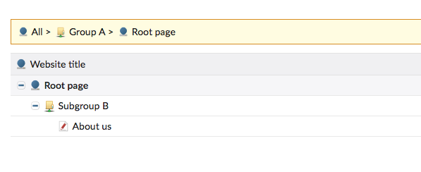

# Folder page for Contao Open Source CMS

The extension provides a new page type for Contao that allows you to group
pages into folders. If you have many pages, this tiny bundle can greatly improve
the usability.



## Installation

Install the bundle via Composer:

```
composer require terminal42/contao-folderpage
```

## Configuration

There's absolutely nothing to configure :-)
